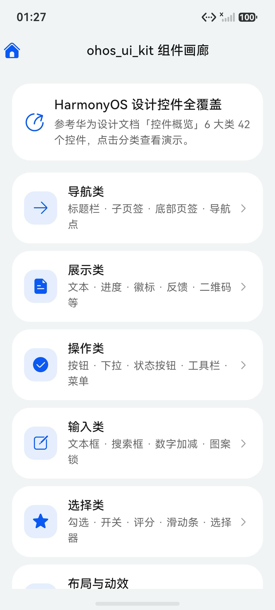
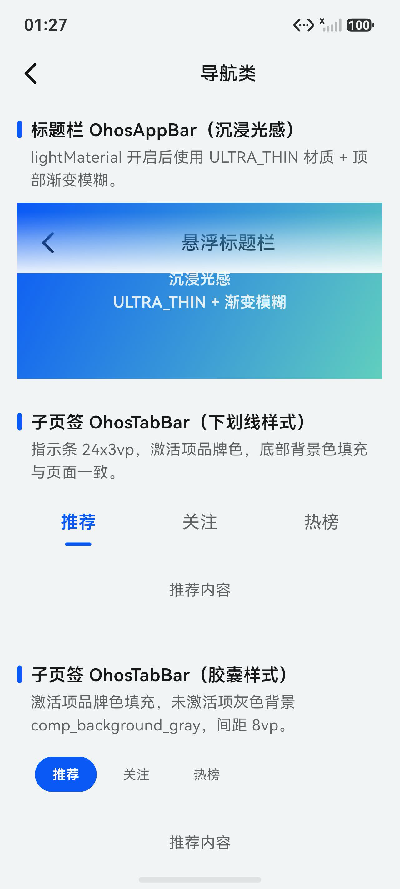
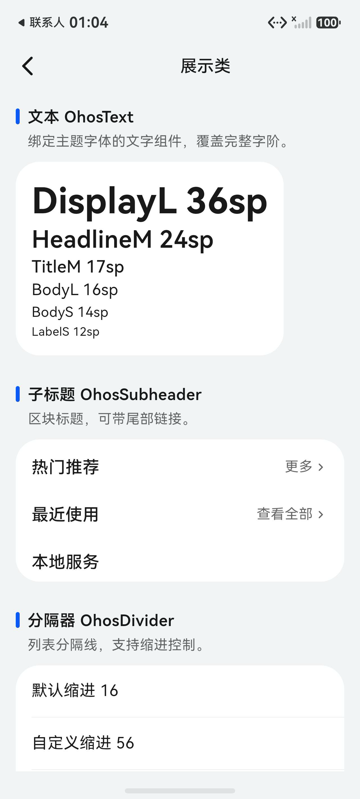
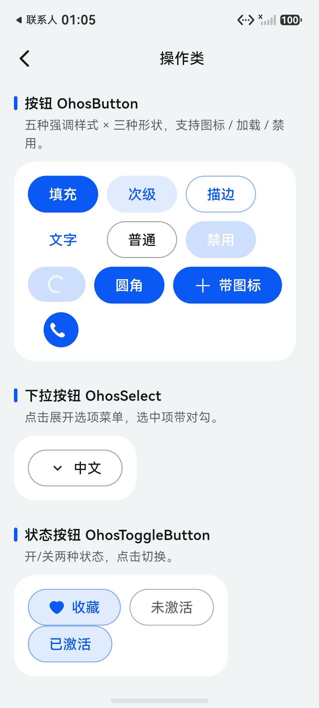
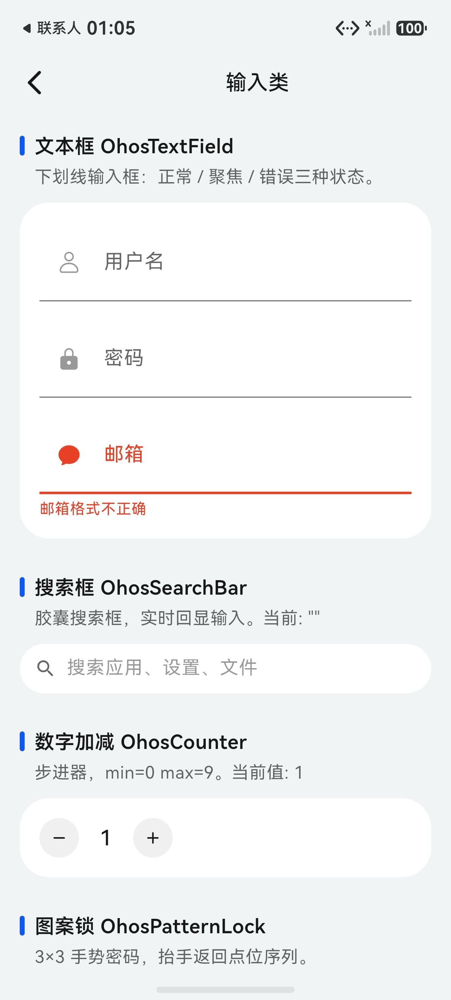
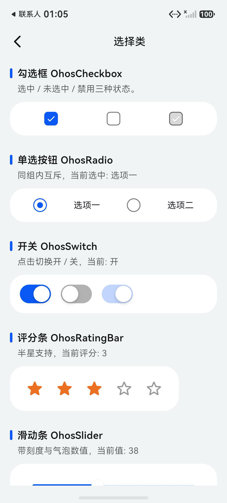
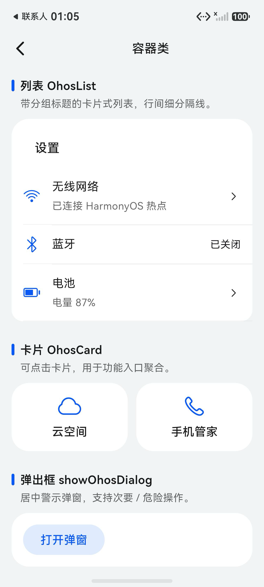

# ohos_ui_kit

<p align="center">
  
  
  
  
  
  
  
</p>

[](https://github.com/shaohushuo/ohos_ui/actions/workflows/ci.yml)
[](LICENSE)

> 状态：代码已发布到 GitHub，pub.dev 发布计划中（仓库名 `ohos_ui`，包名 `ohos_ui_kit`）。

Material / Cupertino 风格的 Flutter 组件库，实现了 **HarmonyOS 设计语言**（华为鸿蒙「设计入门」规范），并完整覆盖官方「控件概览」文档中的 **6 大类 42 个控件**。组件命名与 API 尽可能对齐 Flutter 内置的 `Material*` / `Cupertino*` 组件，方便迁移：

| Material / Cupertino | ohos_ui_kit |
| --- | --- |
| `Theme` / `ThemeData` | `OhosTheme` / `OhosThemeData` |
| `Scaffold` / `AppBar` | `OhosScaffold` / `OhosAppBar` |
| `ElevatedButton` / `CupertinoButton` | `OhosButton`（5 种样式 × 3 种形状） |
| `ListTile` / `CupertinoListTile` | `OhosListTile` / `OhosList` |
| `Card` | `OhosCard` |
| `Switch` / `Checkbox` / `Radio` | `OhosSwitch` / `OhosCheckbox` / `OhosRadio` |
| `TextField` / `SearchBar` | `OhosTextField` / `OhosSearchBar` |
| `NavigationBar` / `TabBar` | `OhosNavigationBar` / `OhosTabBar` |
| `Slider` / `RatingBar` | `OhosSlider` / `OhosRatingBar` |
| `AlertDialog` / `showDialog` | `OhosAlertDialog` / `showOhosDialog` |
| `SnackBar` / `showMenu` | `OhosSnackBar` / `showOhosMenu` |
| `Badge` | `OhosBadge` |
| `FilterChip` | `OhosChip` |
| `Divider` / `IconButton` | `OhosDivider` / `OhosIconButton` |

配套图标包：[ohos_icons](https://pub.dev/packages/ohos_icons)（HarmonyOS Symbol 字体图标，已发布）。

## 特性

- **HarmonyOS 设计令牌**：主题色 `#0A59F7` / `#317AF7`、11 色多彩色板、功能色、四级文字/图标透明度（90%/60%/40%/20%）、组件分层背景（`comp_background_primary/gray`）、20%/10% 品牌高亮背景（`comp_emphasize_secondary/tertiary`）与交互态色（hover/pressed/focus/select），全部对齐官方 Token 表。
- **明暗双主题**：`OhosThemeData.light()` / `OhosThemeData.dark()` 开箱即用，支持 `copyWith` 定制。
- **API 对齐 Flutter**：使用方式与 Material/Cupertino 组件一致，学习成本低。
- **原生字体**：默认使用 HarmonyOS 系统字体 `HarmonyOS Sans`（非鸿蒙平台自动回退系统字体）。
- **沉浸光感材质**：`OhosLightMaterial` 实现官方 ULTRA_THIN … ULTRA_THICK 五档毛玻璃背板，支持顶部/底部渐变模糊，AppBar、底部页签、半模态面板开箱即用。
- **响应式布局**：`OhosResponsiveBuilder` + `OhosGrid` 实现 600/840vp 断点（4/8/12 列）、16/24/32vp 边距与 8/12/16vp 槽宽，侧边页签在 ≥840vp 自动生效。
- **转场动效**：`OhosGeometry` 提供与官方「转场动效」一致的弹簧/缓出曲线与 90/200/300/400ms 时长，配套「一镜到底」共享元素演示。
- **零平台依赖**：纯 Dart / Flutter 实现，唯一第三方依赖为二维码生成 `qr` 包。
- **完整控件覆盖**：官方「控件概览」6 大类 42 个控件全部实现，见下方清单。

## 安装

### 通过 pub.dev（发布后）

```bash
fvm flutter pub add ohos_ui_kit
```

### 通过 Git（当前推荐）

```bash
fvm flutter pub add ohos_ui_kit \
  --git-url git@github.com:shaohushuo/ohos_ui.git

# 或直接在 pubspec.yaml 中声明
# dependencies:
#   ohos_ui_kit:
#     git:
#       url: https://github.com/shaohushuo/ohos_ui.git
#       ref: main
```

## 快速开始

```dart
import 'package:flutter/material.dart';
import 'package:ohos_ui_kit/ohos_ui_kit.dart';

void main() => runApp(const MyApp());

class MyApp extends StatelessWidget {
  const MyApp({super.key});

  @override
  Widget build(BuildContext context) {
    return MaterialApp(
      home: OhosTheme(
        data: OhosThemeData.light(), // 或 OhosThemeData.dark()
        child: OhosScaffold(
          appBar: OhosAppBar(title: const Text('我的应用')),
          body: Center(
            child: OhosButton(
              onPressed: () {},
              child: const Text('开始使用'),
            ),
          ),
          bottomNavigationBar: OhosNavigationBar(
            currentIndex: 0,
            onDestinationSelected: (int index) {},
            destinations: const [
              OhosNavigationDestination(
                icon: Icon(Icons.home_filled),
                label: '首页',
              ),
              OhosNavigationDestination(
                icon: Icon(Icons.person_filled),
                label: '我的',
              ),
            ],
          ),
        ),
      ),
    );
  }
}
```

## 控件覆盖（对应官方「控件概览」42 控件）

### 导航类

| 控件 | 实现 |
| --- | --- |
| 标题栏 | `OhosAppBar` |
| 子页签 | `OhosTabBar` |
| 底部页签 | `OhosNavigationBar` |
| 导航点 | `OhosPageIndicator`（见 `ohos_swiper.dart`）|
| 轮播 | `OhosSwiper` |

### 展示类

| 控件 | 实现 |
| --- | --- |
| 文本 / 子标题 | `OhosText`（`OhosTextLevel` 全字阶）/ `OhosSubheader` |
| 图片 | `OhosImage`（支持选中描边）|
| 分隔器 | `OhosDivider` |
| 进度条 | `OhosProgressIndicator`（圆形 / 线性）|
| 新事件标记 | `OhosBadge`（数字 / 红点）|
| 索引条 | `OhosAlphabetIndexer` |
| 滚动条 | `OhosScrollbar` |
| 即时反馈 / 即时操作 | `showOhosToast` / `showOhosSnackBar` |
| 气泡提示 | `showOhosPopup` |
| 数据可视化 | `OhosDataPanel` |
| 二维码 | `OhosQrCode` |
| 空白 | `OhosBlank` |
| 文本时钟 | `OhosTextClock` |

### 操作类

| 控件 | 实现 |
| --- | --- |
| 按钮 | `OhosButton`（filled / tonal / outlined / text / plain × 胶囊 / 圆角 / 圆形）|
| 下拉按钮 | `OhosSelect` |
| 状态按钮 | `OhosToggleButton` |
| 操作块 | `OhosChip` |
| 工具栏 | `OhosToolbar` |
| 核心操作栏 | `OhosActionBar` |
| 菜单 | `showOhosMenu`（列表 / 宫格）|

### 输入类

| 控件 | 实现 |
| --- | --- |
| 文本输入 | `OhosTextField`（正常 / 聚焦 / 错误态）|
| 搜索框 | `OhosSearchBar` |
| 数字加减 | `OhosCounter` |
| 图案锁 | `OhosPatternLock` |

### 选择类

| 控件 | 实现 |
| --- | --- |
| 勾选框 / 单选按钮 / 开关 | `OhosCheckbox` / `OhosRadio` / `OhosSwitch` |
| 评分条 | `OhosRatingBar`（支持半星）|
| 滑动条 | `OhosSlider`（刻度 / 气泡数值）|
| 选择器 | `showOhosPicker` |
| 颜色选择器 | `OhosColorPicker` |
| 分段按钮 | `OhosSegmentedButton` |

### 容器类

| 控件 | 实现 |
| --- | --- |
| 列表 / 列表项 | `OhosList` / `OhosListTile` |
| 卡片 | `OhosCard` |
| 弹出框 | `OhosAlertDialog` / `showOhosDialog` |
| 气泡提示 | `showOhosPopup` |
| 半模态面板 | `showOhosBottomSheet` |

## 设计语言实现（对齐官方设计规范）

实现均对照官方文档的「色彩」「布局」「沉浸光感」「响应式」「转场动效」章节，示例代码见 `example/lib/pages/layout_page.dart` 与 `navigation_page.dart`。

### 色彩 Token

`OhosColors` 与 `OhosThemeData` 中的颜色 1:1 对应官方 Token 表（`0xAARRGGBB`）：

- 文字/图标四级：`font_primary #E5000000`、`font_secondary #99000000`、`font_tertiary #66000000`、`font_fourth #33000000`（深色模式对应白色系列）。
- 背景分层：`background_secondary #F1F3F5`（页面）、`background_tertiary #E5E5EA`、`comp_background_primary #FFFFFF`（卡片/组件）、`comp_background_gray #F1F3F5`（灰底）。
- 品牌高亮背景：`comp_emphasize_secondary #330A59F7`（20%）、`comp_emphasize_tertiary #190A59F7`（10%），用于选中态与悬浮强调。
- 交互事件色：`interactive_hover #0C000000`、`interactive_pressed #19000000`、`interactive_focus #FF0A59F7`、`interactive_select #330A59F7`。
- 组件直接取主题字段：`theme.emphasizeSecondaryColor`、`theme.compBackgroundGrayColor`、`theme.interactivePressedColor` 等。

### 沉浸光感（Immersive Light）

```dart
// 顶部悬浮：ULTRA_THIN + 渐变模糊
OhosLightMaterial(
  level: OhosLightMaterialLevel.ultraThin,
  gradientFade: OhosLightFade.top,
  child: OhosAppBar(lightMaterial: true, title: const Text('标题')),
)

// 底部悬浮：THIN + 渐变蒙层
OhosNavigationBar(
  type: OhosNavigationBarType.float,
  lightMaterial: true,
  destinations: destinations,
  ...
)

// 半模态 / 大弹层：ULTRA_THICK
showOhosBottomSheet(context: context, title: '分享', content: ...);
```

- 五档模糊强度映射：ULTRA_THIN=8、THIN=16、REGULAR=24、THICK=32、ULTRA_THICK=40（sigma）。
- `OhosBottomSheet` 默认 ULTRA_THICK 材质；`OhosAppBar(lightMaterial: true)` 默认 ULTRA_THIN。

### 布局基础（栅格 / 断点 / 边距）

- 断点：`<600vp` 紧凑 / `600–840vp` 中 / `≥840vp` 宽；栅格 4/8/12 列，边距 16/24/32vp，槽宽 8/12/16vp，内容最大 2220vp。
- `OhosResponsiveBuilder` 依据窗口宽度重建子树；`OhosGrid` + `OhosGridItem(columnSpan:)` 直接按栅格排布：

```dart
OhosGrid(
  children: [
    OhosGridItem(columnSpan: 2, child: card),
    OhosGridItem(columnSpan: 2, child: card),
  ],
)
```

### 响应式布局方法

- **挪移**：`OhosNavigationBar` 为纯内容组件；在宽屏（≥840vp）建议配合侧边页签使用（导航结构文档的「侧边 Tab」模式），示例可参考 `OhosWindowSize.useSideTab`。
- **折行/缩放/分栏**：`example` 的「响应式断点」演示按断点切换 1/2/4 列，展示 compact/medium/large 三种窗口形态。

### 转场动效（Transition / Motion）

- 运动曲线：`OhosGeometry.spring`（按压反馈）、`easeOut`（界面转场）、`sharedElement`（一镜到底共享转场）。
- 时长：90ms 按压反馈 / 200ms 普通转场 / 300ms 共享转场 / 400ms 页面转场。
- 层级关系：同层级（编辑/页签）、上下层级（父子页面）、跨层级（应用间）分别对应不同曲线。
- 一镜到底：共享元素放大转场演示见「转场动效 一镜到底」Demo（`AnimatedContainer` + `sharedElement` 曲线）。

### 与官方控件的重点一致性

| 规范点 | 官方值 | 实现 |
| --- | --- | --- |
| 下划线子页签指示条 | 24×3vp 品牌色 | `OhosTabBar`（underline） |
| 胶囊子页签激活填充 | 品牌色实色填充 | `OhosTabBar(type: capsule)` / `OhosChipGroup` |
| 胶囊子页签未激活背景 | `comp_background_gray` 灰底 | `OhosChipGroup` |
| 胶囊间距 | 不宜过大（默认 8vp） | `OhosChipGroup(spacing: 8)` |
| 底部页签高度 | 平铺 48vp / 悬浮 56vp | `OhosNavigationBar` 默认值 |
| 底部页签激活高亮 | 20% 品牌色 `comp_emphasize_secondary` | `OhosNavigationBar` 选中胶囊 |
| 图标尺寸 | 24×24vp | `OhosNavigationBar(iconSize: 24)` |
| 页签数量建议 | 3–5 个 | 文档建议，未强制 |

## 使用示例


### 主题

```dart
final OhosThemeData theme = OhosTheme.of(context); // 任意组件内获取
theme.highlightColor;        // 品牌色 #0A59F7
theme.backgroundColor;       // 页面背景
theme.cardColor;             // 卡片背景
theme.multiColors;           // 11 色多彩色板
theme.typography.bodyLarge;  // 文字样式
```

```dart
OhosTheme(
  data: OhosThemeData.dark().copyWith(
    highlightColor: const Color(0xFF0A59F7),
    dangerColor: const Color(0xFFE84026),
  ),
  child: const MyApp(),
)
```

### 按钮

```dart
OhosButton(onPressed: _save, child: const Text('保存'));               // 填充
OhosButton(
  onPressed: _save,
  style: OhosButtonStyle.tonal,   // 次级
  child: const Text('保存'),
);
OhosButton(
  onPressed: _cancel,
  style: OhosButtonStyle.outlined, // 描边
  shape: OhosButtonShape.rounded,  // 24vp 圆角方块
  child: const Text('取消'),
);
OhosButton(
  onPressed: _refresh,
  loading: true,                   // 加载态
  icon: const Icon(Icons.refresh),
  child: const Text('刷新'),
);
```

### 底部导航与角标

```dart
OhosNavigationBar(
  currentIndex: _index,
  onDestinationSelected: (int i) => setState(() => _index = i),
  destinations: const [
    OhosNavigationDestination(
      icon: Icon(OhosIcons.square_grid_2x2),
      label: '组件',
    ),
    OhosNavigationDestination(
      icon: Icon(OhosIcons.person),
      label: '我的',
      badge: OhosBadge(count: 5), // 可选角标
    ),
  ],
)
```

### 列表与卡片

```dart
OhosList(
  header: const OhosSubheader(title: '设置'),
  children: [
    OhosListTile(
      leading: const Icon(OhosIcons.wifi),
      title: const Text('无线网络'),
      subtitle: const Text('已连接'),
      trailing: const Icon(OhosIcons.chevron_right),
      onTap: _openWifi,
    ),
    OhosListTile(
      leading: const Icon(OhosIcons.moon_fill),
      title: const Text('深色模式'),
      selected: true, // 选中态品牌色高亮
      trailing: OhosSwitch(value: true, onChanged: _onDarkMode),
    ),
  ],
)
```

### 表单输入

```dart
OhosSearchBar(
  hintText: '搜索',
  onChanged: (String query) {},
  onSubmitted: (String query) {},
);

OhosTextField(
  labelText: '用户名',
  prefixIcon: const Icon(Icons.person),
  onChanged: (String v) {},
);

OhosTextField(
  labelText: '密码',
  obscureText: true,
  errorText: '密码至少 8 位', // 错误态
);
```

### 评分 / 滑动 / 选择

```dart
OhosRatingBar(value: 3, onChanged: (int v) {}, starSize: 32);

OhosSlider(
  value: _volume,
  onChanged: (double v) {},
  min: 0,
  max: 100,
  divisions: 20,
  showValueBubble: true, // 拖动时气泡数值
);

OhosSegmentedButton<String>(
  segments: const [
    OhosSegment(label: '日', value: 'day'),
    OhosSegment(label: '周', value: 'week'),
  ],
  selected: _view,
  onSelected: (String v) {},
);

// 底部弹窗选择器
final String? city = await showOhosPicker<String>(
  context: context,
  title: '选择城市',
  initialValue: _city,
  items: const [
    OhosPickerItem(label: '北京', value: 'beijing'),
    OhosPickerItem(label: '上海', value: 'shanghai'),
  ],
);
```

### 对话框 / 半模态面板 / 菜单 / 气泡

```dart
final bool? ok = await showOhosDialog<bool>(
  context: context,
  title: '删除文件？',
  content: '删除后无法恢复，请确认是否继续。',
  actions: [
    OhosDialogAction(
      label: '取消',
      onPressed: () => Navigator.pop(context, false),
    ),
    OhosDialogAction(
      label: '删除',
      danger: true,
      onPressed: () => Navigator.pop(context, true),
    ),
  ],
);

await showOhosBottomSheet(
  context: context,
  title: '分享到',
  content: SizedBox(
    height: 200,
    child: Row(
      mainAxisAlignment: MainAxisAlignment.spaceEvenly,
      children: <Widget>[
        // 分享入口图标
      ],
    ),
  ),
);

final String? action = await showOhosMenu<String>(
  context: context,
  items: const [
    OhosMenuItem(label: '复制', icon: Icons.copy_rounded, value: 'copy'),
    OhosMenuItem(label: '删除', icon: Icons.delete_rounded, value: 'delete', danger: true),
  ],
);

showOhosPopup(
  context: context,
  content: '长按扫码支付',
  targetKey: payButtonKey, // GlobalKey
);
```

### 即时反馈 / 进度 / 二维码

```dart
showOhosToast(context, '操作成功', icon: OhosIcons.checkmark_circle_fill);

showOhosSnackBar(
  context,
  message: '已删除 1 个文件',
  actionLabel: '撤销',
  onAction: () => showOhosToast(context, '已撤销'),
);

const OhosProgressIndicator.circular();                     // 无限转圈
OhosProgressIndicator.linear(value: 0.6);                   // 线性进度

OhosQrCode(data: 'https://github.com/shaohushuo/ohos_ui'); // 二维码
```

## 在 HarmonyOS 模拟器上运行 Demo

`example/` 是一个展示全部控件的画廊应用（6 大控件分类 + 布局与动效分类，共 7 个入口）。要求使用鸿蒙社区 Flutter 分叉：

- 仓库：`https://atomgit.com/CPF-Flutter/flutter_flutter`
- 推荐分支：`oh-3.35.7-release`
- 通过 [fvm](https://fvm.app) 管理：`fvm use ohos/oh-3.35.7-release`

### 1. 准备环境

需要 DevEco Studio 内置工具链（node / ohpm / hvigor）与 OpenHarmony SDK：

```bash
export DEVECO_SDK_HOME=/Applications/DevEco-Studio.app/Contents/sdk
export JAVA_HOME=/Applications/DevEco-Studio.app/Contents/jbr/Contents/Home
export PATH="/Applications/DevEco-Studio.app/Contents/tools/node/bin:/Applications/DevEco-Studio.app/Contents/tools/ohpm/bin:/Applications/DevEco-Studio.app/Contents/tools/hvigor/bin:$HOME/Library/OpenHarmony/Sdk/26.0.0/toolchains:$PATH"
```

> 本仓库自带 `env.sh`，`source env.sh` 即可。

### 2. 生成 ohos 平台工程并拉取依赖

```bash
cd example
fvm flutter pub get
fvm flutter create --platforms ohos .
```

### 3. 构建 HAP 并安装到模拟器

```bash
fvm flutter build hap --debug --no-codesign
hdc list targets              # 确认模拟器在线（如 127.0.0.1:5555）
hdc install -r build/ohos/hap/entry-default-unsigned.hap
hdc shell aa start -a EntryAbility -b com.example.ohos_ui_example
```

### 4. 截图（可选）

```bash
hdc shell snapshot_display -f /data/local/tmp/home.jpeg
hdc file recv /data/local/tmp/home.jpeg ./gallery_home.png
```

> 字体：鸿蒙设备自带 `HarmonyOS Sans`，ohos_ui_kit 会自动使用；其他平台自动回退系统字体。

## 截图

所有截图来自 OpenHarmony 模拟器（API 26，1280×2832）实机运行：

| 页面 | 截图 |
| --- | --- |
| 主页（7 大分类）| `doc/screenshots/gallery_home.png` |
| 导航类：沉浸光感标题栏 / 下划线+胶囊子页签 / ChipGroup 多选 / 平铺+悬浮底部页签 | `doc/screenshots/gallery_navigation.png` |
| 导航类（滚动）：胶囊子页签 / ChipGroup / 底部页签 | `doc/screenshots/gallery_navigation_capsule.png` |
| 导航类（滚动）：平铺式 + 悬浮式底部页签 | `doc/screenshots/gallery_navigation_bottom.png` |
| 布局与动效：栅格系统 / 响应式断点 / 沉浸光感 / 转场动效 | `doc/screenshots/gallery_layout_grid.png` |
| 布局与动效（滚动）：沉浸光感 THIN/THICK 材质 | `doc/screenshots/gallery_layout_light.png` |
| 布局与动效（滚动）：一镜到底共享元素 / 动效曲线对比 | `doc/screenshots/gallery_layout_motion.png` |
| 布局与动效（交互）：共享元素放大转场 | `doc/screenshots/gallery_shared_element.png` |
| 展示类：文本 / 图片 / 进度 / 徽标 / 索引条 / 滚动条 / 反馈 / 气泡 / 数据面板 / 二维码 / 文本时钟 / 空白 | `doc/screenshots/gallery_display.png` |
| 操作类：按钮 / 下拉 / 状态按钮 / 操作块 / 工具栏 / 核心操作栏 / 菜单 | `doc/screenshots/gallery_action.png` |
| 输入类：文本框 / 搜索框 / 数字加减 / 图案锁 | `doc/screenshots/gallery_input.png` |
| 选择类：勾选 / 单选 / 开关 / 评分 / 滑动条 / 分段按钮 / 颜色选择器 / 选择器 | `doc/screenshots/gallery_selection.png` |
| 容器类：列表 / 卡片 / 弹出框 / 气泡 / 半模态面板 | `doc/screenshots/gallery_container.png` |
| 弹出框（交互）| `doc/screenshots/gallery_dialog.png` |
| 半模态面板（交互）| `doc/screenshots/gallery_bottom_sheet.png` |
| 气泡提示（交互）| `doc/screenshots/gallery_popup.png` |
| 菜单（交互）| `doc/screenshots/gallery_menu.png` |

## 设计来源

- 华为鸿蒙设计入门文档：https://developer.huawei.com/consumer/cn/design/devstart/
- 控件概览（42 控件清单）：https://developer.huawei.com/consumer/cn/doc/doccenter-ux-design/general_overview-0000001929599380
- 色彩 Token：https://developer.huawei.com/consumer/cn/doc/doccenter-ux-design/color-0000001776857164
- 沉浸光感：https://developer.huawei.com/consumer/cn/doc/doccenter-ux-design/immersivelight-0000002612101053
- 布局基础（栅格/断点）：https://developer.huawei.com/consumer/cn/doc/doccenter-ux-design/design-layout-basics-0000001795579413
- 响应式布局（结构/方法）：https://developer.huawei.com/consumer/cn/doc/doccenter-ux-design/design-responsive-layout-structure-0000001748539684
- 转场动效：https://developer.huawei.com/consumer/cn/doc/doccenter-ux-design/design-concepts-0000001795698445
- 子页签规范：https://developer.huawei.com/consumer/cn/doc/doccenter-ux-design/chipsgroup-0000001929788350
- 底部页签规范：https://developer.huawei.com/consumer/cn/doc/doccenter-ux-design/bottomtab-0000001956787789
- HarmonyOS-Design（设计原则 Skill 库）：https://github.com/dososo/HarmonyOS-Design
- HarmonyOS 官方 AppIcon 设计源文件（Sketch）

## 常见问题

- **构建时报 `npm not found`？** 需要把 DevEco Studio 内置工具加入 PATH（node / ohpm / hvigor），参见上方「准备环境」。
- **`flutter build hap` 签名报错？** 使用 `--no-codesign` 构建后 `hdc install`，模拟器免签名运行。
- **首页顶部内容被标题栏遮挡？** 已修复：`OhosScaffold` 将 `OhosAppBar` 与 `body` 按 Column 布局（v0.1.0 之前为 Stack 叠加）。
- **pub.dev 还没发布？** 是的，当前以 GitHub 代码为主；发布后 `fvm flutter pub add ohos_ui_kit` 即可。

## License

MIT
